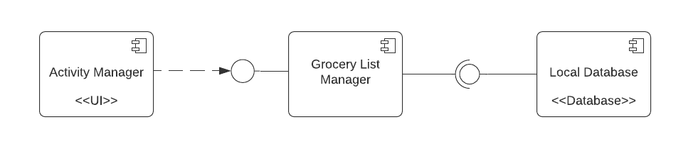
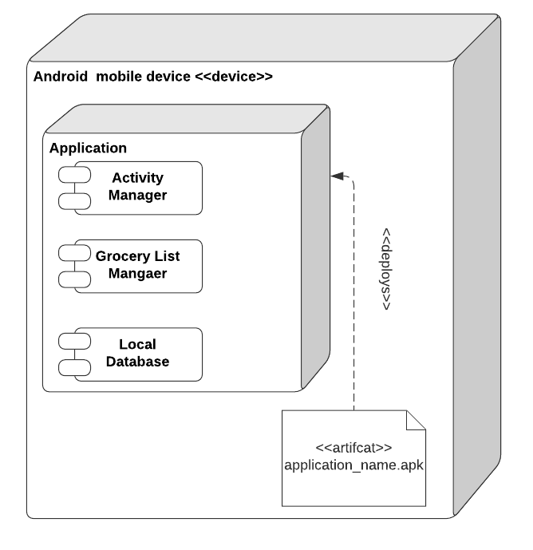
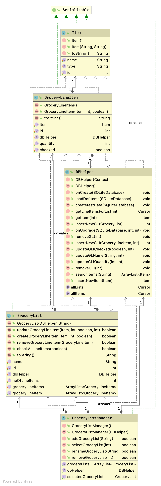
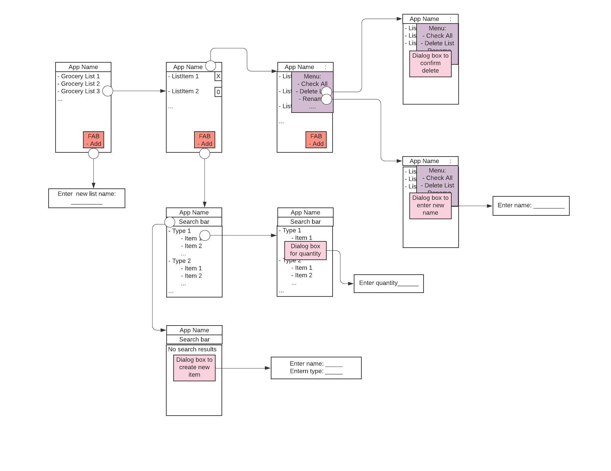

# Design Document

**Author**: Team4

## 1. Design Considerations

_The subsections below describe the issues that need to be addressed or resolved prior to or while completing the design, as well as issues that may influence the design process._

### 1.1 Assumptions

- This application will have a dependency on a local SQLite database.
- This application will only be available in English so we are assuming the user can speak/write English.
- Application shall run only on android phone or tablet.
- User is already aware of product availability on specific store because app is not connected to specific store's database.
- App shall be build in Java using Android Studio
- The application's user interface must be functional across most if not all form factors for android devices

### 1.2 Constraints

- The user must select a list to perform most of the available features except adding a new list or create an item since these two operations are independent from list itself.
- Since its app requirement to have a persistent data therefore some database must be used.
- Since app shall use SQLite database therefore there must be an optimized database design to avoid using unnecessary disk space.
- User can have maximum 50 grocery list.

### 1.3 System Environment

- This application will run on an Android phone or tablet. We will be targeting Andoird API level 30 (Android 11). And the minimum API level we will support will be level 21 (Android 5.0 Lollipop).
- App shall use the local database ( SQLite)

## 2 Architectural Design

Following are component and deployment diagrams.

### 2.1 Component Diagram

### 2.2 Deployment Diagram

## 3. Low-Level Design

### 3.1 Class Diagram

## 4. User Interface Design

