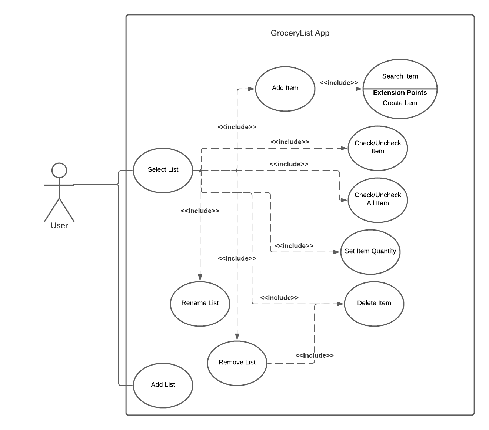

Use Case Model

**Author**: Team 4

## 1 Use Case Diagram

## 2 Use Case Descriptions

| Use Case Name  | Add List                                                                                                           |
| -------------- | ------------------------------------------------------------------------------------------------------------------ |
| Requirements   | The user creates one empty list.                                                                                   |
| Actor          | User                                                                                                               |
| Pre-Condition  | No grocery list exist                                                                                              |
| Post-Condition | One empty list is created.                                                                                         |
| Scenarios      | 1.The user opens the grocery list application. 2.The user clicks the new list button. 3.One empty list is created. |

| Use Case Name  | Select List                                                                         |
| -------------- | ----------------------------------------------------------------------------------- |
| Requirements   | The user selects a list to operate on it.                                           |
| Actor          | User                                                                                |
| Pre-Condition  | At least one list exists.                                                           |
| Post-Condition | A list is selected.                                                                 |
| Scenarios      | 1.The user opens the grocery list application. 2.The user selects an existing list. |

| Use Case Name  | Rename List                                                                                                                                              |
| -------------- | -------------------------------------------------------------------------------------------------------------------------------------------------------- |
| Requirements   | The user selects a list to rename.                                                                                                                       |
| Actor          | User                                                                                                                                                     |
| Pre-Condition  | At least one list exists.                                                                                                                                |
| Post-Condition | Selected list is renamed.                                                                                                                                |
| Scenarios      | 1.The user opens the grocery list application. 2.The user selects an existing list. 3.The user clicks the rename list button 4. Selected list is renamed |

| Use Case Name  | Remove List                                                                                                                                              |
| -------------- | -------------------------------------------------------------------------------------------------------------------------------------------------------- |
| Requirements   | The user selects a list to remove.                                                                                                                       |
| Actor          | User                                                                                                                                                     |
| Pre-Condition  | At least one list exists.                                                                                                                                |
| Post-Condition | Selected list is removed.                                                                                                                                |
| Scenarios      | 1.The user opens the grocery list application. 2.The user selects an existing list. 3.The user clicks the remove list button 4. Selected list is removed |

| Use Case Name  | Add Item                                                                                                                                          |
| -------------- | ------------------------------------------------------------------------------------------------------------------------------------------------- |
| Requirements   | The user adds item to a list.                                                                                                                     |
| Actor          | User                                                                                                                                              |
| Pre-Condition  | A list must be selected.                                                                                                                          |
| Post-Condition | Item is added to this list.                                                                                                                       |
| Scenarios      | 1.The user selects a list. 2.The user clicks the add item button. 3.Display item menu for selecting. 4.The user selects items to add to the list. |

| Use Case Name  | Search Item                                                                                                                                                                                          |
| -------------- | ---------------------------------------------------------------------------------------------------------------------------------------------------------------------------------------------------- |
| Requirements   | The user searchs item in local database                                                                                                                                                              |
| Actor          | User                                                                                                                                                                                                 |
| Pre-Condition  | The user want to search new item in local database                                                                                                                                                   |
| Post-Condition | Show searching result.                                                                                                                                                                               |
| Scenarios      | 1.The user clicks the search item button. 2.Searching Item in local database. 3. Display searching result. 4.If a match cannot be found, ask the user if he wants to add a new item to the Database. |

| Use Case Name  | Create Item                                                                                    |
| -------------- | ---------------------------------------------------------------------------------------------- |
| Requirements   | The user adds new item to local database.                                                      |
| Actor          | User                                                                                           |
| Pre-Condition  | After searching item in database, no match can be found.                                       |
| Post-Condition | New item is added to database.                                                                 |
| Scenarios      | 1.The user searchs item in database. 2.If a match cannot be found; add a new item to Database. |

| Use Case Name  | Check Item                                                                                                                                                    |
| -------------- | ------------------------------------------------------------------------------------------------------------------------------------------------------------- |
| Requirements   | The user check off item(s) in a list without deleting them.                                                                                                   |
| Actor          | User                                                                                                                                                          |
| Pre-Condition  | A list must be selected.                                                                                                                                      |
| Post-Condition | Selected items are marked as checked.                                                                                                                         |
| Scenarios      | 1.The user selects one list. 2.The user clicks the check button. 3.Select item. 4 Check off selected items in this list. 5.The user can select mutiply items. |

| Use Case Name  | Set Item Quantity                                                                                                                                                                     |
| -------------- | ------------------------------------------------------------------------------------------------------------------------------------------------------------------------------------- |
| Requirements   | The user set quantity for item(s) in a list.                                                                                                                                          |
| Actor          | User                                                                                                                                                                                  |
| Pre-Condition  | A list must be selected. An item must be selected.                                                                                                                                    |
| Post-Condition | The user set quantity for a selected item.                                                                                                                                            |
| Scenarios      | 1.The user selects a list. 2.The user selects an item. 3.The user clicks the set item quantity button. 4.The user sets quantity for a selected item. 5. Item quantity cannot be zero. |

| Use Case Name  | Delete Item                                                                                                                           |
| -------------- | ------------------------------------------------------------------------------------------------------------------------------------- |
| Requirements   | The user delete item(s) in a list.                                                                                                    |
| Actor          | User                                                                                                                                  |
| Pre-Condition  | A list must be selected. One item must be selected.                                                                                   |
| Post-Condition | The user deleted a selected item.                                                                                                     |
| Scenarios      | 1.The user selects a list. 2.The user selects an item. 3.The user clicks the delete item button. 4.Remove selected item in this list. |
